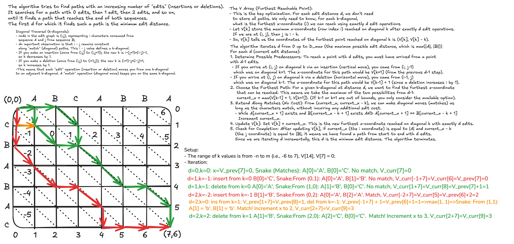

# Rust Diff

A command-line utility and library for computing the difference between two strings, implemented in Rust. This project
uses the Myers's O(ND) diff algorithm with a linear space refinement to efficiently find the shortest edit script.

The core algorithm is a "divide and conquer" approach based on Eugene W. Myers' paper, which finds the shortest edit
script in `O(N*D)` time and `O(N)` space, a significant improvement over the classic `O(N*M)` dynamic programming
solution.

## Features

- **Efficient Diffing**: Implements Myers's O(ND) algorithm.
- **Memory Optimized**: Uses a linear space refinement (similar to Hirschberg's algorithm) to handle large inputs
  without excessive memory consumption.
- **Clear Visualization**: Provides a colorful command-line output to easily spot differences.
    - **<ins style="color:green;">Insertions are green and underlined</ins>**.
    - **Deletions are red and parenthesized**.
    - Matches are in the default terminal color.
- **Dual Use**: Can be used as a command-line tool or as a library in other Rust projects.

## How It Works

This implementation is based on the algorithm described in
Eugene W. Myers's paper, *"An O(ND) Difference Algorithm and Its Variations"*.

The key ideas are:

1. **Edit Graph**: The problem is modeled as finding the shortest path on an "edit graph" where horizontal edges
   represent deletions, vertical edges represent insertions, and diagonal edges represent matches.
2. **Furthest-Reaching D-Paths**: Instead of filling a full `(N+1)x(M+1)` matrix, the algorithm only searches for the
   endpoints of paths with exactly `D` edits. This reduces the time complexity from `O(NM)` to `O((N+M)D)`.
3. **Linear Space Refinement**: To reconstruct the path without storing all intermediate states (which would take
   `O((N+M)D)` space), we use a "divide and conquer" strategy.
    - The algorithm finds the "middle snake"—a central diagonal path segment—by running the search from both the start
      and the end simultaneously and finding where they overlap.
    - This middle snake splits the problem into two smaller sub-problems, which are solved recursively.
    - This refinement reduces the space complexity to `O(N+M)` while maintaining a time complexity of `O((N+M)D)`.

For more details, refer to the original paper: http://www.xmailserver.org/diff2.pdf.

## License

This project is licensed under the MIT License.
